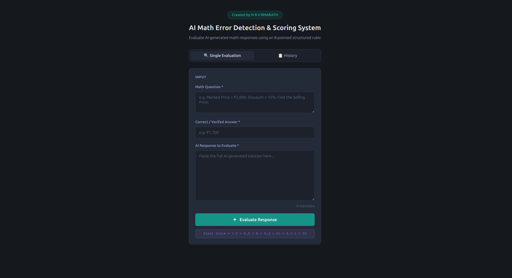
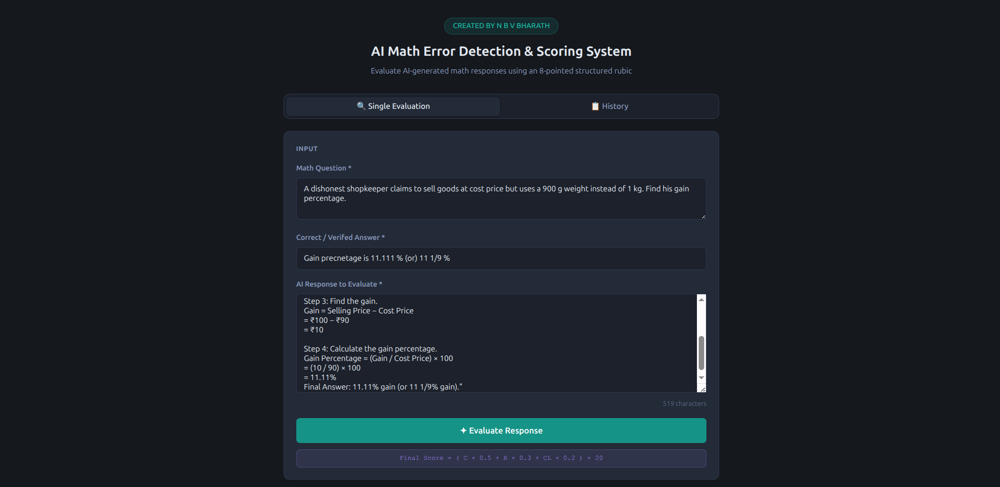
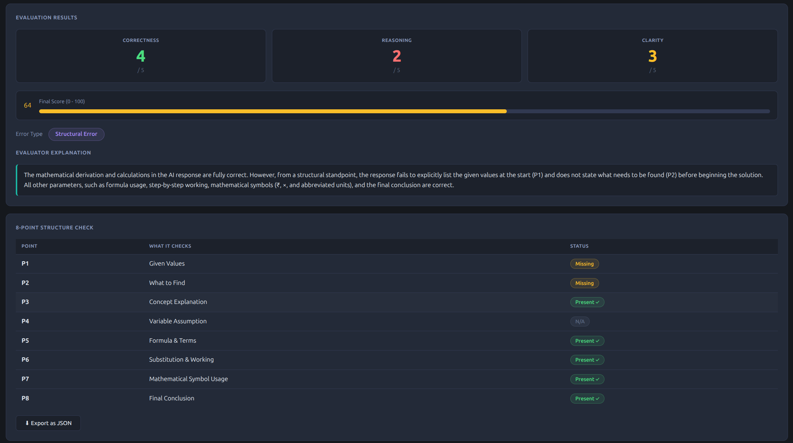

# AI Math Error Detection & Scoring System

A web-based tool that automatically detects errors in AI-generated math
responses and scores them using a structured 8-point evaluation rubric.
Built as part of an LLM evaluation research project.

---

## What It Does

- Takes a math question, correct answer, and AI-generated response as input
- Evaluates the response across 8 structural points (P1–P8)
- Assigns Correctness, Reasoning, and Clarity scores (0–5 each)
- Calculates a weighted Final Score (0–100)
- Classifies the error type from 10 categories
- Shows a full P1–P8 structure check with colour-coded badges
- Keeps session history of all evaluations
- Exports any evaluation as a JSON file

---

## 8-Point Evaluation Rubric

| Point | What It Checks | Type |
|---|---|---|
| P1 | Given Values stated at start | Mandatory |
| P2 | What to Find identified | Mandatory |
| P3 | Concept Explanation | Optional |
| P4 | Variable Assumption | Optional |
| P5 | Formula and Terms | Optional |
| P6 | Substitution and Working | Mandatory |
| P7 | Mathematical Symbol Usage | Mandatory |
| P8 | Final Conclusion with units | Mandatory |

---

## Scoring Formula

Final Score = (Corectness x 0.5 + Reasoning x 0.3 + Clarity x 0.2) x 20

Result is between 0.0 and 100.0

---

## Error Types Detected

- No Error
- Structural Error
- Conceptual Error
- Methodology Error
- Calculation Error
- Sign Error
- Unit Error
- Symbol Error
- Incomplete Solution
- Multiple Errors

---

## Tech Stack

| Layer | Technology |
|---|---|
| Frontend | HTML, CSS, JavaScript |
| Backend | Python, Flask |
| AI Model | Google Gemini 3.6 Flash API |
| Evaluation | Custom 8-point rubric prompt |

---

## Project Structure

### ai-math-scorer
- index.html - page structure
- style.css - dark theme styling
- script.js - tab switching, validation, API call,results display
- server.py - Flask backend connecting to Gemini API
- README.md - this file

---

## How to Run Locally

### 1. Clone the repository
```bash
git clone https://github.com/yourusername/ai-math-error-detection-scoring
cd ai-math-error-detection-scoring
```

### 2. Create and activate virtual environment
```bash
python3 -m venv venv
source venv/bin/activate
```

### 3. Install dependencies
```bash
pip3 install flask flask-cors google-genai
```

### 4. Add your Gemini API key
Open `server.py` and replace the API key:
```python
API_KEY = "your-gemini-api-key-here"
```

Get a free key at: https://aistudio.google.com

### 5. Start the server
```bash
python3 server.py
```

### 6. Open the tool
Open `index.html` in your browser. The tool is ready to use.

---

## Example Evaluation

**Input:**
- Question: Marked Price = ₹2,000, Discount = 15%. Find the Selling Price.
- Correct Answer: ₹1,700
- AI Response: Given MP = 2000, Discount = 15%. Discount = 300. SP = 1700. Final Answer: Rs. 1700

**Output:**
- Correctness: 4/5
- Reasoning: 4/5
- Clarity: 3/5
- Final Score: 76/100
- Error Type: Symbol Error
- P7: Incorrect (used Rs. instead of ₹, used x instead of ×)

---

## Screenshot
### Website Interface


### Final Scores



---

## Related Project

This tool was built as part of a two-project LLM evaluation series:

- **Project 1:** [LLM Math Response Evaluation Dataset](https://github.com/yourusername/llm-math-evaluation-dataset)
  — 150 manually annotated AI math responses across GPT-4o, Claude, and Gemini

- **Project 2:** This tool — automated scoring system validated against the
  Project 1 human-annotated ground truth

---

## Author

**N B V BHARATH**
AI Evaluation Researcher
